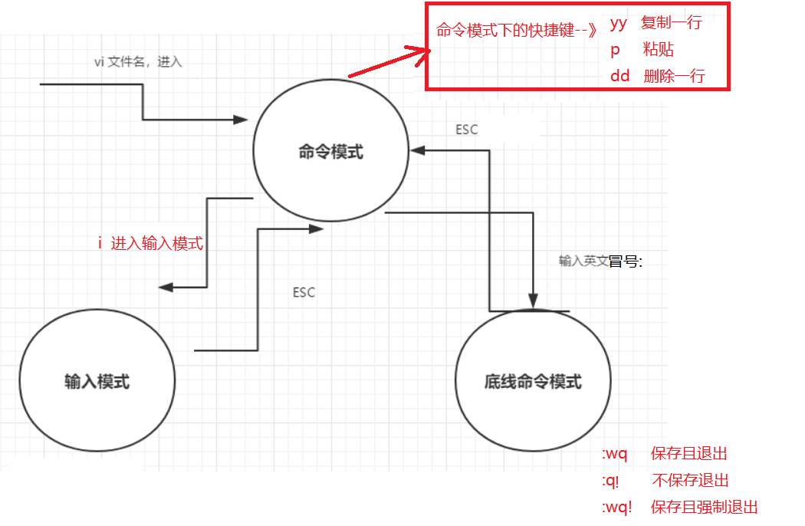
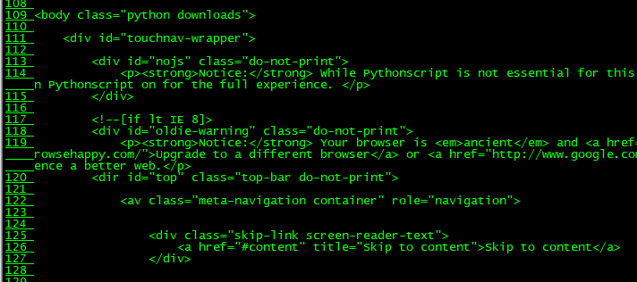

## Linux 的 vi/vim 使用介绍

所有的类Unix系统一般都会内建 vi 文本编辑器。
目前使用较多的是vim编辑器。
vim 具有程序编辑的能力，可以主动的以字体颜色辨别语法的正确性，方便程序设计。

### 什么是vim？

Vim 是 vi 发展出来的一个文本编辑器。代码补全、编译以及错误跳转等方便编程的功能特别丰富，程序员可广泛使用。

vi 是老式的编辑处理器，vim 是脱胎于老式的vi。

### vi/vim 的使用

基本上 vi/vim 分为三种模式，分别是  **命令模式**、**输入模式**、**底线命令模式**。

#### 命令模式

用户刚刚启动 vi/vim，便进入了命令模式。
此状态下敲击键盘会被Vim认为是命令，而非输入字符。比如此时输入一个b字符，并不会输入一个字符，而是把b当作一个命令去执行。

常用命令：

- **i** ： 切换到输入模式
- **x** ： 删除当前光标所在处的字符
- **:** ： 切换到底线命令模式，在最第一行输入命令

若想要编辑文本，启动vim，进入了命令模式，按下i，切换到了输入模式。
命令模式只有一些最基本的命令，因此仍要依靠底线命令模式输入更多命令。

#### 输入模式

在命令模式下按下i就进入了输入模式。
在输入模式，可以使用以下案件：
- 字符键以及shift组合，输入字符
- ENTER ，回车键，换行
- BACK SPACE，退格键，删除光标前一个字符
- DEL，删除光标前一个字符
- 方向键，在文本中移动光标
- HOME/END ，移动光标到行首/行尾
- Page Up/Page Down， 上/下翻页
- Insert， 切换光标为输入/替换模式，光标将变成竖线/下划线
- ESC，退出输入模式，切换到命令模式

#### 底线命令模式

在命令模式下按下英文:就进入了底线命令模式。
底线命令模式可以输入单个或多个字符的命令，可用的命令非常多。
在底线模式中，基本命令有：
- q, 退出程序
- w，保存文件

按ESC键可随时推出底线命令模式。

命令模式、输入模式、底线模式三者示例切换：

- **1.vi 进入文件的命令模式**
- **2.命令模式下按i进入输入模式**
- **3.输入模式下按ESC退出输入模式，当前为命令模式**
- **4.接着步骤3，按:，进入底线命令模式**
- **5.接着4，按ESC退出底线命令模式，当前为命令模式**
- **6.接着5，按i进入输入模式**




Vi 命令模式下的按键说明：

|按键|描述|
|----|----|
|Ctrl+f|向下移动一页相当于pagedown|
|Ctrl+b|向上移动一页，相当于pageup|
|Ctrl+d|向上移动半页|
|Ctrl+u|向上移动半页|
|-|光标移动到非空格符的上一行|
|0或者功能键|数字0，移动到这一行的最前面字符处|
|$或功能键End|移动到这一行的最后面字符|
|gg|移动到这个档案的第一行|
|n+Enter|n为数字。光标向下移动n行|

**搜索**

|操作|描述|
|----|----|
|/word|向光标之下寻找为word的字符串|
|?word|向光标之上寻找word的字符串|
|n|代表前一个搜寻的动作。例如前面执行/Python向下搜寻Python，找到第一个，然后按n会继续搜寻下面的匹配结果|
|N|与n相反，为反向进行前一个搜寻动作。|

**替换**

|操作|描述|
|----|----|
|:n1,n21/word1/words/g|n1、n2均为数字。在第n1和n2行之间寻找word1这个字符串，并将该字符串替换为word2.比如在1-100行之间将所有的Python替换为Java则使用：```:1,100s/Python/Java/g```|
|:1,$s/word1/word2/g 或者 :%s/word1/word2/g|从第一行到最后一行寻找word1字符串，并将该字符串取代为word2|
|:1,$s/word1/word2/gc 或者 :%s/word1/word2/gc|从第一行到最后一行寻找word1字符串，并将该字符串取代为word2。但是会提示字符让用户确认|

**删除**

|操作|描述|
|----|----|
|x、X|在一行字当中，x为向后删除一个字符。X为向前删除一个字符|
|nx|n为数字，连续向后删除n个字符。7x表示向后连续删除10个字符|
|dd|删除游标所在的一整行|
|ndd|n为数字。删除光标所在的向下n行，例如10dd则表示删除后面10行|
|d1G|删除光标所在到第一行的所有数据|
|dG|删除光标所在到最后一行的数据|
|d$|删除游标所在处，到该行的最后一个字符|
|d0|数字0；删除游标所在处，到该行的最前面一个字符|

**复制**

|操作|描述|
|----|----|
|yy|复制游标所在的那一行|
|nyy|n是数字，复制光所在行的向下n行，例如 20yy则是复制向下20行|
|y1G|复制游标所在行到第一行的所有数据|
|yG|复制游标所在行到最后一行的所有数据|
|y0|复制光标所在处到该行行首的所有数据|
|y$|复制光标所在的那个字符到该行行尾的所有数据|

**粘贴**

|操作|描述|
|----|----|
|p，P|p粘贴在游标上一行；P粘贴在游标下一行|
|J|将光标所在行和下一行连接成同一行|
|c|重复删除多个数据。例如向下删除10行，10cj|
|u|复原上一个动作。就是撤销上一个动作|


**底线指令模式常用操作**

|操作|描述|
|----|----|
|:w|将编辑的数据写入磁盘档案中，保存|
|:w!|文件为只读属性时，强制写入该档案|
|:q|离开vi|
|:q!|若曾更改过文档，又不想保存，使用!强制离开|
|!在vi中具有强制的含义|
|:wq|保存后离开|
|:wq!|强制存储后离开|
|ZZ|若档案没有更改，则不储存离开，若档案已经被更改过，则储存后离开|
|:w [filename]|将编辑的数据储存成另一个档案（类似新存档）|
|:r [filename]|在编辑的数据中，读入另一个档案的数据，即将filename这个档案内容添加到游标所在行后面|
|:n1,n2 w [filename]|将n1到n2的内容储存成filename这个档案|
|:! command|暂时离开vi到指令行模式下执行command的显示结果。例如 :!ls /home 即可在vi当中查看/home底下以ls输出的档案信息|


**vim 环境的变更**

|操作|描述|
|----|----|
|:set nu|显示行号，设定之后会在每一行的前缀显示改行的行号|
|:set nonu|与set nu相反，取消显示行号|

**:set nu**



